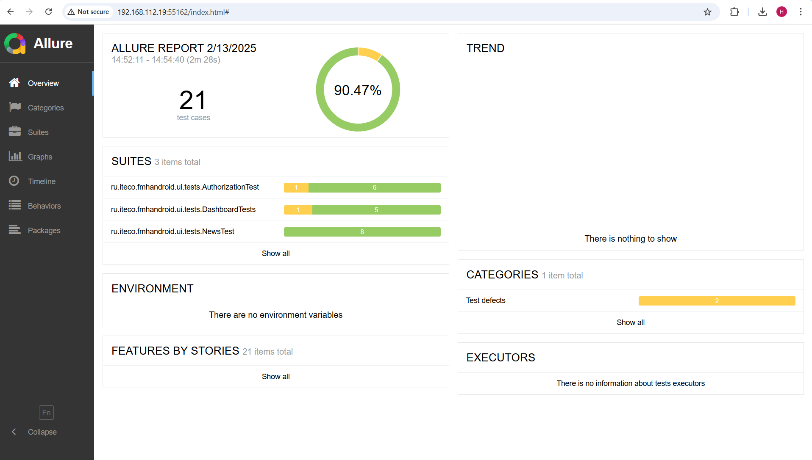
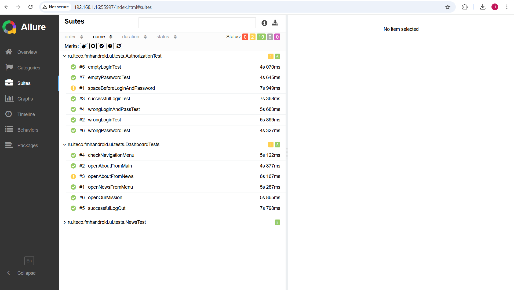

## Отчет о проведенном тестировании мобильного приложения "Мобильный хоспис" версия 1.0.0

**Тестируемое приложение:** fmh_android_15_03_24

**Тестовое окружение:**

Эмулятор: Pixel 8 Pro API 29

Среда разработки: Android Studio

Фреймворки: Espresso, JUnit, Allure

### 1. Проведенные виды тестирования

- Функциональное тестирование – проверка работы основных сценариев
- Автоматизированное тестирование – запуск автотестов через Espresso.

### 2. Автоматизация тестирования

Разработано автотестов: 21

Средства тестирования: Espresso, JUnit 4, Allure

Команда для запуска тестов: ./gradlew connectedAndroidTest

Либо запуск тестов через Project -> App -> Run All Tests

Сбор отчетов в Allure: ./gradlew allureReport

### 3. Результаты тестирования

Авторизация:

1. Успешная авторизация - пройден
2. Авторизация с пустым полем Логин - пройден
3. Авторизация с пустым полем Пароль - пройден
4. Авторизация с неверным логином - пройден
5. Авторизация с неверным паролем - пройден
6. Авторизация с неверным логином и паролем - пройден
7. Авторизация с пробелом перед логином и паролем - не пройден, [Issue #4](https://github.com/NatKobeleva/diplom_mobileHospis/issues/4)

Новости:

1. Успешное добавление новости с рандомными данными - пройден
2. Добавление новости с незаполненными полями - пройден
3. Удаление новости - пройден
4. Редактирование существующей новости - пройден
5. Отмена добавления новости - пройден
6. Сортировка новостей - пройден
7. Пустая фильтрация новостей - пройден
8. Фильтрация новостей по категории - пройден

Дополнительные тесты:

1. Выход из аккаунта - пройден
2. Открытие страницы с цитатами - пройден
3. Открытие навигационного меню - пройден
4. Открытие страницы Новости из меню - пройден
5. Открытие страницы About с главной страницы
6. Открытие страницы About со страницы Новости - не пройден, [Issue #1](https://github.com/NatKobeleva/diplom_mobileHospis/issues/1)

**Итого:** по результатам автоматизированного тестирования было найдено 2 бага

Также были найдены баги в процессе ручного тестирования - [Issue #2](https://github.com/NatKobeleva/diplom_mobileHospis/issues/2), [Issue #3](https://github.com/NatKobeleva/diplom_mobileHospis/issues/3), [Issue #5](https://github.com/NatKobeleva/diplom_mobileHospis/issues/5)

### 4. Общий итог по времени

Запланировано - 148 часов рабочего времени Потрачено всего - 165 рабочего времени

**Время требующееся на прохождение тестов**

Ручное тестирование - 1 час

Автоматизированное тестирование - 5 минут

### 5. Заключение и рекомендации

Основные функции приложения работают корректно. Однако само приложение требует доработки в связи с нестабильностью поведения (часто бывало недоступно, зависало, по разному вело себя в течение суток), а так же в связи с отсутствием некоторых важных функций (например регистрация пользователя, восттановление пароля)

Обнаруженые в процессе автоматизированного и ручного тестирования баги требуют исправление перед релизом.

Рекомендуется интеграция автотестов в CI/CD (GitHub Actions/Jenkins).

В заключение можно сказать, что ручное тестирование требует меньше времени на старте, но становится более трудоёмким при дальнейшем использовании. Автоматизированное тестирование, наоборот, требует больше времени на начальном этапе, но позволяет экономить время и ресурсы в долгосрочной перспективе.
